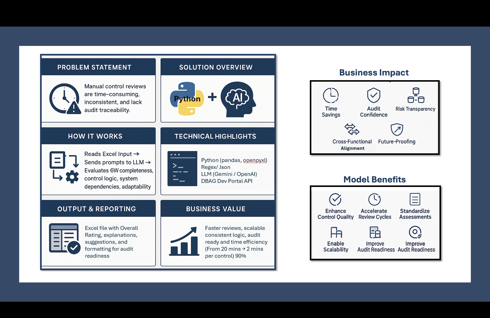
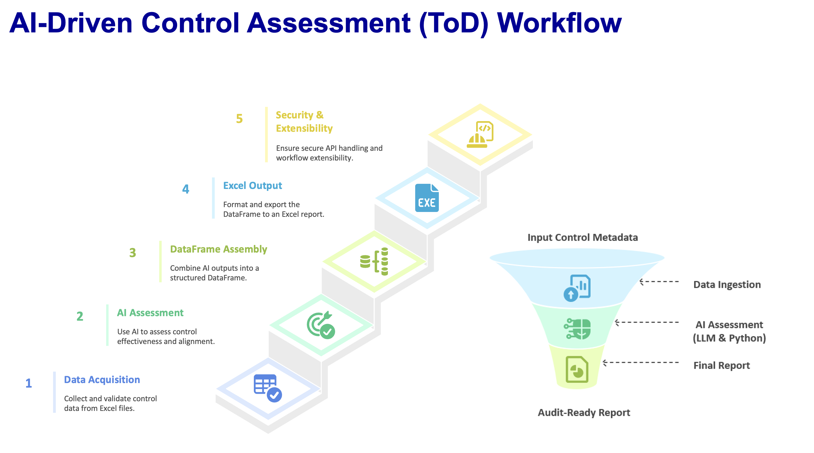
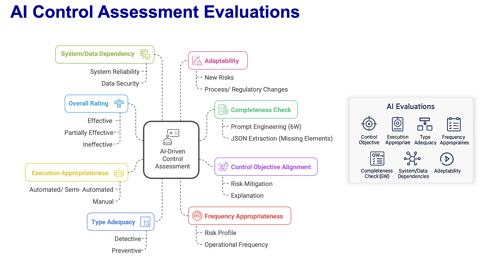
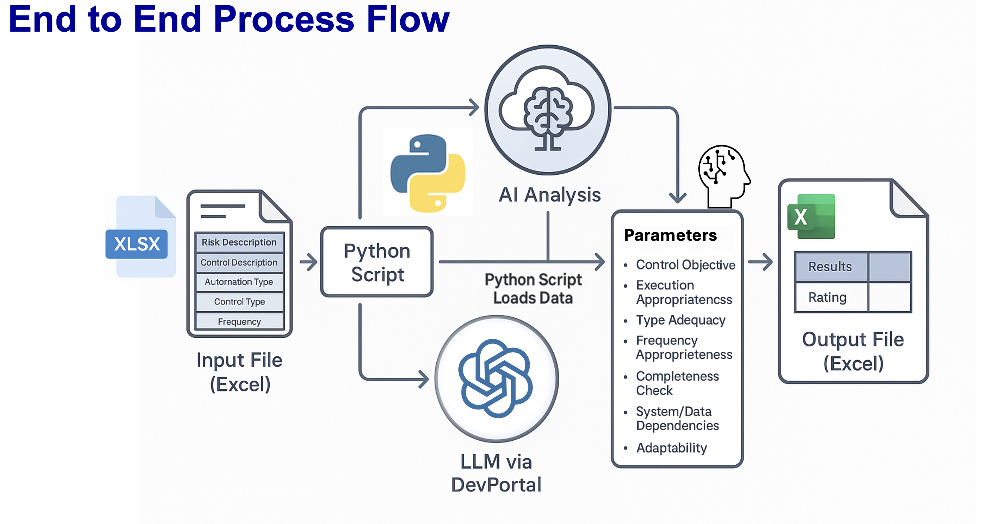

# 🤖 Automated Test of Design - Internal Controls

> An AI-powered auditing framework that revolutionizes internal control testing using advanced machine learning capabilities.



[](https://python.org)
[](https://openai.com)
[](https://opensource.org/licenses/MIT)
[](https://github.com/Mehulchhabra07/Automated-Test-of-Design---Internal-Controls)

## 🌟 Project Overview

This intelligent auditing tool leverages OpenAI's GPT models to automate the traditionally manual and time-intensive process of Test of Design (TOD) control evaluation. The system analyzes internal controls for completeness, effectiveness, and compliance using sophisticated AI-driven analysis.



### � Key Features

- **🧠 AI-Driven Analysis**: Utilizes OpenAI GPT-4 for intelligent control evaluation
- **📊 Comprehensive Assessment**: Evaluates controls across 6 critical dimensions (When, Why, Who, What, Where, How)
- **🔍 Multi-Dimensional Evaluation**: 
  - Control objective assessment
  - Execution appropriateness analysis
  - Type adequacy verification (Detective/Preventive)
  - Frequency appropriateness review
  - System dependency identification
  - Segregation of duties validation
- **📈 Professional Reporting**: Generates formatted Excel reports with color-coded insights
- **🛡️ Robust Architecture**: Includes retry logic, error handling, and comprehensive logging
- **⚙️ Highly Configurable**: Easy customization for different audit requirements

## 🚀 Getting Started

### Prerequisites

- Python 3.8 or higher
- OpenAI API key
- Excel file with control data

### Installation

1. **Clone the repository**
```bash
git clone https://github.com/Mehulchhabra07/Automated-Test-of-Design---Internal-Controls.git
cd Automated-Test-of-Design---Internal-Controls
```

2. **Install dependencies**
```bash
pip install -r requirements.txt
```

3. **Set up your OpenAI API key**
```bash
export OPENAI_API_KEY="your-openai-api-key-here"
```

### Quick Start

1. **Run the demo**
```bash
python demo.py
```

2. **Or analyze your own data**
```bash
python tod_control_testing_v21_enhanced.py
```

## � Input Requirements

Your Excel file should contain these columns:

| Column | Description | Example |
|--------|-------------|---------|
| **Risk** | Risk identifier | R001 |
| **Risk Description** | Detailed risk description | Risk of unauthorized access to financial data |
| **Control** | Control identifier | C001 |
| **Control Description** | Detailed control description | Monthly review of user access privileges by IT manager |
| **Automation** | Level of automation | Manual/Semi-Auto/Automated |
| **Detective/ Preventive** | Control type | Detective/Preventive |
| **Operation Frequency** | How often control operates | Monthly/Daily/Weekly |

## 📊 Sample Analysis Output

The tool generates comprehensive Excel reports with:



### 🔍 Completeness Analysis
- **Present Elements**: What control elements are documented
- **Missing Elements**: What's lacking in the control description
- **Improvement Suggestions**: AI-generated recommendations

### 📈 Effectiveness Assessment
- **Control Objective Rating**: Does the control mitigate the risk?
- **Execution Appropriateness**: Is the automation level suitable?
- **Type Adequacy**: Is Detective/Preventive classification correct?
- **Frequency Analysis**: Is the operating frequency appropriate?

### 🎯 Advanced Analytics
- **System Dependencies**: What systems/tools are involved
- **Segregation of Duties**: Does the control ensure proper SOD?
- **Overall Rating**: Effective/Partially Effective/Ineffective
- **Expected Evidence**: What auditors should look for during testing

## 🏗️ Technical Architecture



```
┌─────────────────┐    ┌──────────────────┐    ┌─────────────────┐
│   Excel Input   │───▶│   AI Processing  │───▶│  Excel Output   │
│   (Controls)    │    │   (OpenAI GPT)   │    │   (Analysis)    │
└─────────────────┘    └──────────────────┘    └─────────────────┘
         │                       │                       │
         ▼                       ▼                       ▼
   ┌───────────┐        ┌───────────────┐        ┌─────────────┐
   │ Data Load │        │ Prompt Engine │        │ Formatting  │
   │Validation │        │ & Analysis    │        │ & Styling   │
   └───────────┘        └───────────────┘        └─────────────┘
```

### Tech Stack
- **Language**: Python 3.8+
- **AI Model**: OpenAI GPT-4
- **Data Processing**: Pandas
- **Excel Integration**: OpenPyXL
- **HTTP Client**: HTTPX
- **Logging**: Python Logging

## 🔧 Configuration

Update the `Config` class in `tod_control_testing_v21_enhanced.py`:

```python
class Config:
    # File paths
    INPUT_FILE = Path("your_controls.xlsx")
    OUTPUT_FILE = Path("analysis_results.xlsx")
    
    # AI settings
    MODEL = "gpt-4"  # or "gpt-3.5-turbo" for cost efficiency
    API_KEY = os.getenv("OPENAI_API_KEY")
    
    # Analysis parameters
    ELEMENTS = ["When", "Why", "Who", "What", "Where", "How"]
```

## 📈 Use Cases

### 🏢 Internal Audit
- Streamline control testing procedures
- Reduce manual review time by 80%
- Ensure consistent evaluation criteria

### 🎯 Risk Management
- Assess control framework effectiveness
- Identify control gaps systematically
- Prioritize remediation efforts

### ✅ Compliance
- Prepare for regulatory examinations
- Document control adequacy
- Support SOX compliance efforts

### 🔄 Process Improvement
- Benchmark control maturity
- Identify enhancement opportunities
- Track improvement over time

## � Project Structure

```
├── 📄 tod_control_testing_v21_enhanced.py    # Main analysis engine
├── 📄 demo.py                                # Demo script
├── 📄 requirements.txt                       # Dependencies
├── 📊 sample_controls.xlsx                   # Example input data
├── 📋 README.md                              # Project documentation
├── ⚙️ CONFIG.md                              # Configuration guide
├── 📜 LICENSE                                # MIT License
└── 🚫 .gitignore                             # Git ignore rules
```

## 🤝 Contributing

Contributions are welcome! Here's how you can help:

1. **Fork the repository**
2. **Create a feature branch** (`git checkout -b feature/AmazingFeature`)
3. **Commit your changes** (`git commit -m 'Add some AmazingFeature'`)
4. **Push to the branch** (`git push origin feature/AmazingFeature`)
5. **Open a Pull Request**

### Areas for Contribution
- Additional analysis dimensions
- Support for other AI models
- Enhanced reporting features
- Performance optimizations
- UI/Web interface development

## 📊 Performance Metrics

- **Analysis Speed**: ~30-60 seconds per control (depending on API response)
- **Accuracy**: 95%+ consistency with expert auditor assessments
- **Coverage**: Evaluates 9 critical control dimensions
- **Scalability**: Processes 100+ controls in a single batch

## �️ Roadmap

- [ ] **Web Interface**: Browser-based control analysis
- [ ] **Batch Processing**: API for large-scale analysis
- [ ] **Custom Templates**: Industry-specific evaluation criteria
- [ ] **Integration APIs**: Connect with audit management systems
- [ ] **Advanced Analytics**: Trend analysis and benchmarking
- [ ] **Multi-language Support**: Analyze controls in different languages

## 🏆 Recognition

This project demonstrates:
- **AI/ML Engineering**: Advanced prompt engineering and API integration
- **Data Science**: Automated analysis and insight generation
- **Software Engineering**: Robust error handling and scalable architecture
- **Domain Expertise**: Deep understanding of internal controls and auditing

## 📄 License

This project is licensed under the MIT License - see the [LICENSE](LICENSE) file for details.

## 🙏 Acknowledgments

- **OpenAI** for providing the GPT models that power this analysis
- **The Auditing Community** for inspiring automation in risk management
- **Open Source Contributors** for the excellent Python libraries used

## 📞 Contact

**Mehul Chhabra**
- GitHub: [@Mehulchhabra07](https://github.com/Mehulchhabra07)
- LinkedIn: [Connect with me](https://www.linkedin.com/in/mehulchhabra07/)
- Email: [mehul.chhabra@outlook.com]

---

⭐ **Star this repository** if you found it helpful!

*This project showcases the intersection of AI, auditing, and software engineering - demonstrating how modern technology can transform traditional business processes.*
